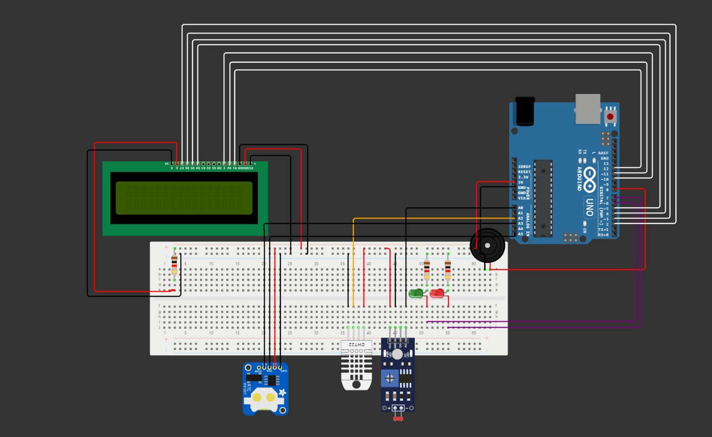

# 🚀 StarTech - Projeto Monitoramento de Ambientes Inteligentes (FESA) 🚀

Este Projeto tem como função desenvolver um PoC (Proof of Concept) baseado na plataforma Arduino UNO R3 que permita medir os valores médios de luminosidade, temperatura e umidade de um ambiente.

## 🔧 Especificações Técnicas:
Os componentes utilizados para este projeto foram:

* 1 MCU (Atmega 328P) - Arduino Uno R3

* 1 LCD 16x2

* 1 LDR

* 1 DHT-11 (Sensor de temperatura e umidade)

* 1 RTC (Real Time Clock)

* 2 LEDs (Cores Vermelha e Verde)

* Resistores

* Buzzer

* 1 Bateria de 9V

* 1 Suporte para bateria

* 1 Protoboard

* Jumpers

## ⚡ Diagrama Elétrico:

## 📋 Manual de Operação:

Para que o sistema inicie, ele deve ser alimentado com uma fonte elétrica, por exemplo uma bateria de 9V, uma vez alimentado, o sistema já começará a realizar as medições e calcular a média ponderada das leituras de luminosidade, umidade e de temperatura. Para que o sistema reinicie é necessário pressionar o botão de 'Reset' localizado na placa Arduino UNO R3.

### 🤝 Integrantes do Projeto:

* Adriana Monteiro Martani

* Davi Teramoto Matheus

* Gustavo Correia Scarabeli

* Leonardo de Carlos Rodrigues

* Matheus Galdino Xavier

* Link do Vídeo Demonstrativo: https://www.youtube.com/watch?v=itQMpo_EJ_g
